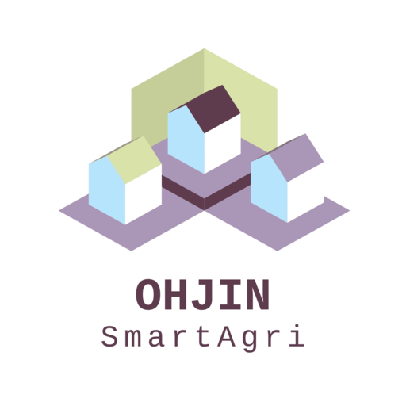

# OHJIN



## Smartagri Server

OHJIN is Server in Smartagri.

Using
- Golang
    - gin-gonic
    - go-xorm
- DB
    - MySQL

- Docker
    - mysql up
    ```
    docker run --name smartagri_db -e MYSQL_DATABASE=smartagri -e MYSQL_ROOT_PASSWORD=mysql -p 3308:3306 mysql:5.7
    ```
    - access
    ```
    mysql -h 0.0.0.0 -P localport -u root -p
    ```
